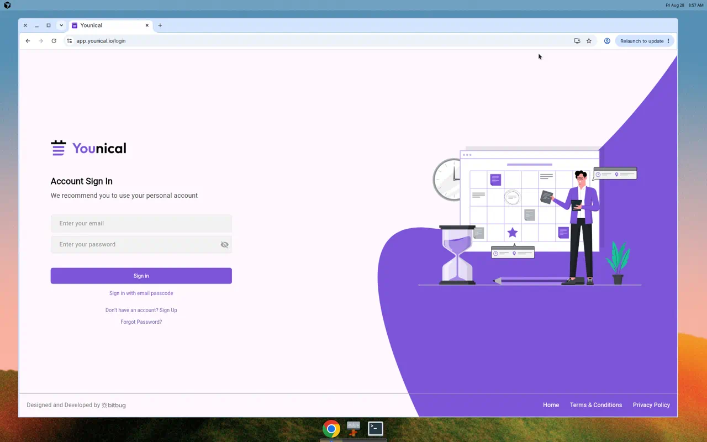

# Younical — auditoría de medidas y tipografía

**URL pedida:** https://app.younical.io/events  
**Fecha:** 28 agosto 2026  
**Viewport medido:** 1259.68 × 1011.81 px (Flutter Web, renderer **CanvasKit**)

## Limitación de acceso

`/events` redirige a `/login` si no hay sesión. La UI de eventos se pinta en canvas (no hay CSS inspectable). Este documento combina:

1. **Cajas reales** de la pantalla de login (árbol de accesibilidad Flutter, `getBoundingClientRect`).
2. **Tokens del binario** `main.dart.js` (colores `Color`, `TextStyle`, `SizedBox`, breakpoints).
3. **Layout de `/events` extraído del mismo bundle** (no se pudo medir en runtime sin credenciales).

Los px de login son exactos (±0.5 px de subpixel). Los de `/events` son los valores compilados en Dart.

---

## Stack

| Item | Valor |
|------|--------|
| Framework | Flutter Web (`calendar_client`) |
| Renderer | CanvasKit (`flt-renderer="canvaskit"`) |
| Fuente de UI | **Roboto** (default Flutter; no hay familia custom en `FontManifest.json`) |
| Iconos | Material Icons, Cupertino Icons, SocialIcons (Amplify) |
| Breakpoints en código | **768** (móvil), **1100** (layout compacto) |

`FontManifest.json` no declara Inter/Outfit/Poppins: el texto de producto usa la familia por defecto de Material (Roboto).

---

## Paleta (tokens Dart → hex)

| Token | Hex | Uso observado |
|-------|-----|----------------|
| `B.I` | `#7E55D8` | Primario: botón Sign in, acentos, overlay del shell |
| `B.ra` | `#7C3AED` | Primario violeta (títulos 18/700, etc.) |
| `B.jb` | `#673AB7` | Links (“Sign in with email passcode”) |
| `B.A4` | `#7E57C2` | Violeta secundario |
| `B.w` | `#000000` | Títulos |
| `B.bl` | `#434343` | Subtítulos |
| `B.aU` | `#757575` | Footer, “All day”, texto secundario |
| `B.bA` / grey 400 | `#9E9E9E` | Placeholders / muted |
| `B.cg` | `#9E9E9E` | Placeholder de inputs |
| `B.o` | `#FFFFFF` | Texto sobre primario, fondos |
| `B.d8` | `#E0E0E0` | Bordes del grid de calendario |
| `B.mO` | `#D50000` | Errores (14 px) |
| `B.ch` | `#64748B` | Slate (labels 12/500) |
| `B.mJ` | `#1E293B` | Texto denso |
| `B.f1` | `#94A3B8` | Meta 12–14 |

---

## Escala tipográfica (app)

Pesos Flutter: `B.E` = **400**, `B.Z` = **500**, `B.ae` = **600**, `B.av` = **700**, `B.tA` = **900**.

Familia: Roboto (Material), `inherit: true` salvo temas M3 densos.

### Login (valores del widget + caja medida)

| Estilo | Size | Weight | Color | Line-height medida | Caja (w × h) |
|--------|------|--------|-------|--------------------|--------------|
| Logo wordmark (`assets/logo.png`) | — | — | — | — | **209.83 × 50** (móvil: alto logo **45**, gap **30**) |
| Título “Account Sign In” | **24** (móvil **20**) | **700** | `#000000` | ~34 / 24 ≈ **1.42** | 170.95 × 34 |
| Subtítulo recomendación | **18** (móvil **16** si width &lt; 768) | 400 | `#434343` | ~26 / 18 ≈ **1.44** | 405.94 × 26 |
| Valor de input | **14** | **500** | `#000000` | default | campo **500 × 48** |
| Placeholder | default theme | **400** | `#9E9E9E` | — | — |
| Botón “Sign in” | theme / 14–16 | 500 (`labelLarge`) | `#FFFFFF` | — | **500 × 44** |
| Link passcode | **14** | 400 | `#673AB7` | — | **500 × 32** |
| Sign Up / Forgot | theme body | 400 | default | — | 221.81 × 32 / 138.08 × 32 |
| Error inline | **14** | 400 | `#D50000` | — | max-width 350 (desktop) / 90% (móvil) |
| Footer | **16** (móvil **12**) | 400 | `#757575` | — | fila **64** de alto |
| Logo Bitbug | — | — | — | — | alto **20** (móvil **16**) |

### Tokens `TextStyle` de producto (también usados fuera del login)

| Token | Size | Weight | Color | Notas |
|-------|------|--------|-------|--------|
| `B.eP` | 28 | 600 | inherit | Títulos de pantalla (p. ej. Share Availability en móvil 24) |
| `B.b2X` | 24 | 700 | inherit | “Synchronizations” |
| `B.b4q` | 18 | 700 | `#7C3AED` | Acento marca |
| `B.b1A` / `B.b3A` | 18 | 700 / 400 | inherit | Títulos de sección |
| `B.e_` | 16 | 600 | inherit | App bar / “Merged Availability” (a veces `.f6(18)`) |
| `B.b1b` | 16 | 600 | `#7E55D8` | Links/acciones primarias |
| `B.b2q` | 16 | 600 | `#434343` | Body semibold |
| `B.b2y` | 14 | 700 | `#000000` | Labels fuertes |
| `B.b2a` | 14 | 400 | `#673AB7` | Links |
| `B.wR` | 14 | 400 | `#434343` | **height 1.4** |
| `B.h2` | 14 | 600 | inherit | Botones texto |
| `B.b1R` | 14 | 400 | grey | “Welcome” |
| `B.V_` | 12 | 700 | `#94A3B8` | letterSpacing **0.8** |
| `B.pn` | 12 | 600 | `#7E55D8` | Chips |
| All-day label | **10** | 400 | `#757575` | Columna del grid |

Material 3 (2021) sigue embebido para widgets que no overridean: display 57/45/36, headline 32/28/24, title 22/16/14, body 16/14/12, label 14/12/11, line-heights 1.22–1.50.

---

## Login — inventario de componentes (medido)

Origen: `docs/younical/login-semantics.json`  
Origen visual: `docs/younical/login-page.webp`

Layout: columna formulario a la izquierda, ilustración a la derecha, footer abajo.

| Componente | x | y | w × h | Notas de layout |
|------------|---|---|-------|-----------------|
| Viewport / root | 0 | 0 | 1259.68 × 1011.81 | Full canvas |
| Bloque principal (group) | 0 | 244.40 | 1259.68 × 523.00 | Form + aire vertical |
| App Logo | 86.00 | 250.40 | 209.83 × 50.00 | `Image` 50 px (45 si móvil) |
| Título | 86.00 | 350.40 | 170.95 × 34.00 | Gap logo→título = **50** (`SizedBox`) |
| Subtítulo | 86.00 | 394.40 | 405.94 × 26.00 | Gap = **10** (`B.d2`) |
| Campo email (widget) | 86.00 | 460.40 | **500 × 48** | Tras `SizedBox` **40** (20 si &lt;768) |
| Overlay HTML email | 86.00 | 460.40 | 506.03 × 52.03 | Hit-target un poco mayor |
| Campo password | 86.00 | 518.40 | **500 × 48** | Gap entre campos = **10** |
| Toggle visibilidad | 546.00 | 522.40 | **40 × 40** | Material icon 59069/59070 |
| Botón Sign in | 86.00 | 596.40 | **500 × 44** | Gap ~**30** tras password; `height: 44`; `width: ∞` en form 500; **radius 6**; bg `#7E55D8`; texto blanco |
| Passcode link | 86.00 | 650.40 | 500 × 32 | |
| Sign Up | 225.09 | 697.40 | 221.81 × 32 | Centrado en el form |
| Forgot Password | 266.95 | 729.40 | 138.08 × 32 | |
| Ilustración “Violeta” | 616.50 | 236.26 | **643.17 × 775.54** | Anclada a derecha/abajo |
| Footer | 0 | 947.81 | 1259.68 × **64** | |
| Crédito Bitbug | 20.00 | 968.81 | 273.71 × 23 | Padding izq **20** |
| Home | 889.80 | 968.81 | 44.02 × 23 | |
| Terms | 963.83 | 968.81 | 143.89 × 23 | gap ~**30** entre links |
| Privacy | 1137.72 | 968.81 | 101.95 × 23 | padding der ~**20** |

### Ritmo del formulario (desktop, width ≥ 768)

```
padding-left formulario     86 px
ancho de controles          500 px
radio inputs / botón        6 px
alto input                  48 px
alto botón primario         44 px
icono ojo                   40 × 40
SizedBox logo → título      50 (móvil 30)
SizedBox título grupo       10
SizedBox subtítulo → form   40 (móvil 20)
gap campos                  10
SizedBox pre-botón          20 (móvil 12)
padding form canvas         EdgeInsets 6 (contenedor)
```

Captura de referencia:



---

## `/events` — estructura (código, no runtime)

Ruta GoRouter `"/events"`: shell con drawer en &lt;768, overlay violeta `B.I` al **35%** de opacidad al abrir paneles.

### Calendario (week/day)

Del widget de columna “All day” + horas:

| Pieza | Medida en Dart |
|-------|----------------|
| Label “All day” | font **10**, color `#757575`, columna **ancho 52**, **alto 52** |
| Borde de celdas | `BorderSide` 1 px `#E0E0E0` |
| Nav item activo | `FontWeight.w600`; inactivo `w400` |
| Empty calendars | “No calendars connected”, estilo muted grey |

Vistas de rango (availability / sync): Hour, Day, Week, Month.

Otras radios habituales en pantallas de calendario/settings: **4, 5, 6, 8, 10, 12, 16, 32**.

Sin sesión no se puede listar tarjetas de evento, sidebar ni app bar de `/events` con cajas reales. Con un usuario de prueba se puede repetir el mismo método (`flt-semantics-placeholder` → dump de nodos).

---

## Cómo se midió

1. Abrir la app, activar semántica Flutter (`flt-semantics-placeholder`).
2. `getBoundingClientRect()` en cada `flt-semantics`.
3. Extraer `TextStyle` / `Color` / `SizedBox` de `main.dart.js` (build 27 ago 2026, etag `9ccd6b93…`).

Para completar `/events` hace falta una sesión válida; no se usaron credenciales.
